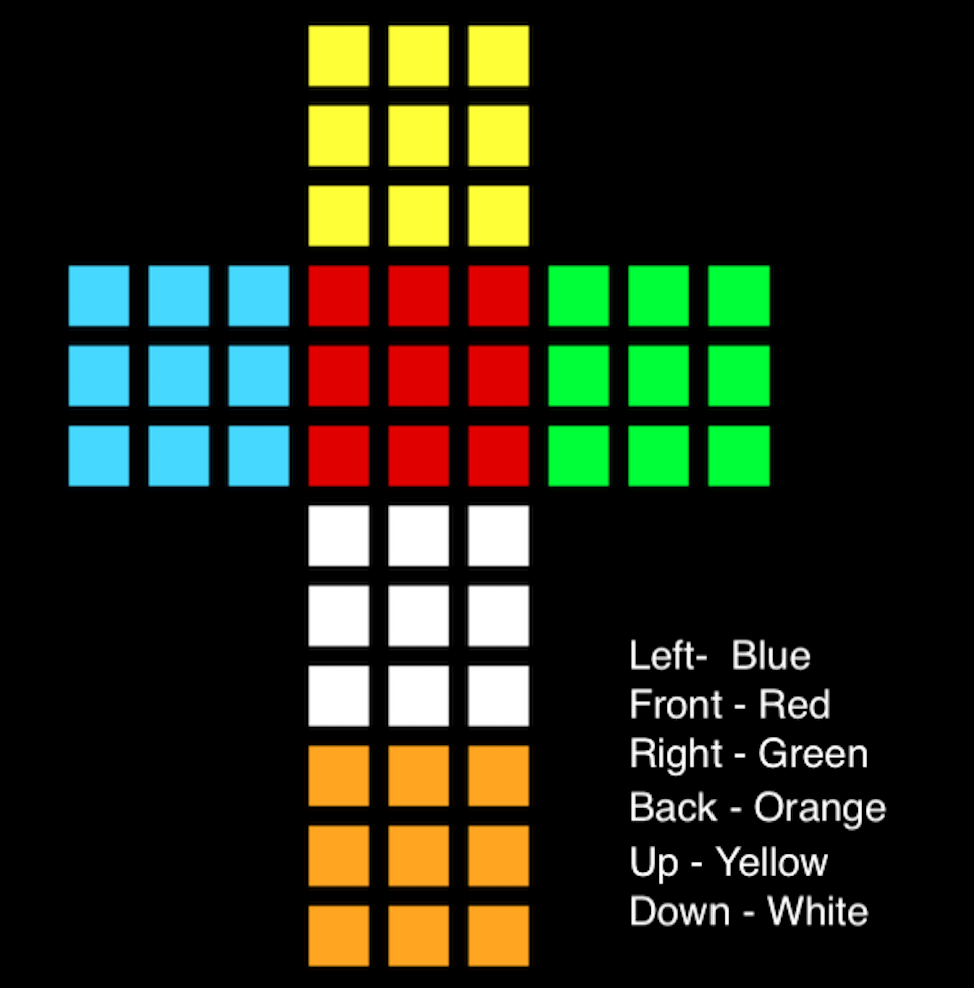

# Thistlewaite's Algorithm

- Algorithm to solve Rubik's Cube.

- It consists of 4 Phases , in my implementation , it can take upto 58 moves to solve the Rubik's Cube.

- In Phase 1 , all the bad edges are fixed. A edge is good if it can be taken to its orginal position without using U or D moves, else it is bad. After this the cube can be solved without using the moves U and D.

- In Phase 2, place all the blue and green facelets on either left or right face. To make things easier, consider both blue and green faclets as a single color, say blue. Once this is done, we can solve this state without U,D,F,B moves.

- Phase 3 is split into 2 parts - 3A and 3B

- My implementation of Phase 3 is different from the Thistlewaite's algorithm, mainly becuase i didn't understand what he meant in his paper 😅.

- In Phase 3A, place all colors either on its corresponding face or its oppossite face, i.e we bring the cube into a state such that all red and orange facelets are either in front or back face, all blue and green facelets are in left or right face, and all yellow and white facelets are in top or bottom. In other words, consider red and orange facelets as red, blue and green facelets as blue, and yellow and white facelets as yellow and then solve the cube.

- In Phase 3B, we try to bring the cube into a state in which all the corners of the same color can be brought back to the same face with only double moves, i.e there can be only even number of coners of the same color in one face and on super superimposing the front face and back face, only corners of the same color can have only 0 or 2 overlaps. You can try this yourself, just take a solved Rubik's Cube and shuffle it with only moves in Group 4. Once this state is acheived, the cube can be solved using just double moves. Some example for invalid states are :
  
  

- In Phase 4, solve the cube by bringing every corners and edges to its actual place.

- Refer https://www.jaapsch.net/puzzles/thistle.htm for more infomation.

| Phase             | 1     | 2         | 3A      | 3B  | 4           |
| ----------------- | ----- | --------- | ------- | --- | ----------- |
| Max Moves         | 7     | 11        | 11      | 14  | 15          |
| No.of States      | 2,048 | 1,082,565 | 4,900   | 144 | 663,552     |
| Forbidden Moves | \_    | U,D       | U,D,F,B | U,D,F,B | R,L,U,D,F,B |

